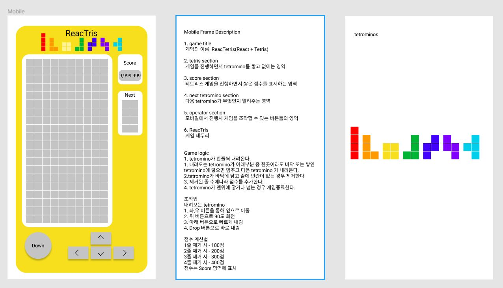

# Reactris 

## Tetris Toy Project of limjs using react and figma

### develop complete / version 1.0

목표
- React의 Virtual DOM Rendering & Component 구조 이해
- figma로 기획 및 퍼블리싱 경험

0. 개발완료

    - React Rendering & LifeCycle & Component 구조 이해
    - 전과정 작업(figma를 이용해서 기획부터 퍼블리싱 작업 개발 테스트) 
    - figma를 바탕으로 css 개발 및 적용

1. 프로젝트 설명

   - React 기반의 테트리스 웹 게임입니다.

     

2. 프로젝트 일정 계획

   <table>
       <thead>
           <tr>
               <th rowspan=3>구분</th>
               <th colspan=12>기간</th>
           </tr>
           <tr>
               <th colspan=12>2020.04</th>
           </tr>
           <tr>
               <th>10</th>
               <th>11</th>
               <th>12</th>
               <th>13</th>
               <th>14</th>
               <th>15</th>
               <th>16</th>
               <th>17</th>
               <th>18</th>
               <th>19</th>
               <th>20</th>
               <th>21</th>
           </tr>
       </thead>
       <tbody>
           <tr>
               <td>설계</td>
               <td style="background-color:#F7DF1E;">✓</td>
               <td style="background-color:#F7DF1E;">✓</td>
               <td style="background-color:#F7DF1E;">✓</td>
               <td style="background-color:#F7DF1E;">✓</td>
               <td></td>
               <td></td>
               <td></td>
               <td></td>
               <td></td>
               <td></td>
               <td></td>
               <td></td>
           </tr>
           <tr>
               <td>개발</td>
               <td></td>
               <td></td>
               <td></td>
               <td></td>
               <td style="background-color:#F7DF1E;">✓</td>
               <td style="background-color:#F7DF1E;">✓</td>
               <td style="background-color:#F7DF1E;">✓</td>
               <td style="background-color:#F7DF1E;">✓</td>
               <td style="background-color:#F7DF1E;">✓</td>
               <td style="background-color:#F7DF1E;">✓</td>
               <td></td>
               <td></td>
           </tr>
           <tr>
               <td>테스트</td>
               <td></td>
               <td></td>
               <td></td>
               <td></td>
               <td></td>
               <td></td>
               <td></td>
               <td></td>
               <td></td>
               <td></td>
               <td style="background-color:#F7DF1E;">✓</td>
               <td style="background-color:#F7DF1E;">✓</td>
           </tr>
       </tbody>
   </table>

   
3. wireframe 설계 및 퍼블리싱
   
   
4.  참고
   - [기획,설계 및 퍼블리싱(figma)](https://www.figma.com/file/yoOCik1e4GCMHbwmjjotMC/Tetris-Toy-Project-of--limjs?node-id=0%3A1)
   - [source repository](https://github.com/LIMJONGSOO/Tetris.git)

5. 버전업 필요사항
    - 점수에 따른 Tetromino 내려오는 속도 증가 로직
   

